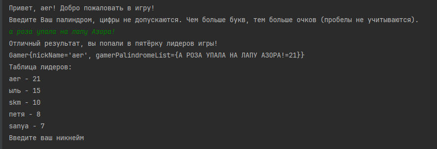

Палиндром - слово или фраза, одинаково читающееся в обоих направлениях.
Например:
 

• топот
 

• а роза упала на лапу Азора
 

ЗАДАНИЕ: 
нужно спроектировать и написать логическое ядро (набор взаимосвязанных компонентов)
игры, которая бы принимала на вход слово/фразу, проверяла, 
является ли эта фраза/слово палиндромом и если да, то начисляла бы пользователю очки 
в зависимости от длины фразы/слова (+1 за каждый символ).
 

Так же у игры должна быть “доска лидеров”, на которой бы хранились 5 пользователей с наибольшим количеством очков.
 

Игра не должна проверять слово/фразу на грамотность и на существование таких слов в реальности.
 

Нужно написать только ядро такой игры, не нужно думать о UI или о том, как слова/фразы попадают 
в систему из внешнего мира, а только базовые классы/интерфейсы, обеспечивающие описанный функционал.
 

Игра хранит свое состояние в памяти.
 

Игра длится бесконечно и у нее нет очередности, но один и тот же пользователь не должен получать 
очки за фразу, которую он уже использовал.
 

При проектировании можно предусмотреть дальнейшее расширение, например, подключение какой-нибудь базы данных.
Пример кода должен быть написан на Java SE (не ниже 8, или выше) без использования каких-либо фрэймворков (кроме maven и junit).

ПРИМЕР:
